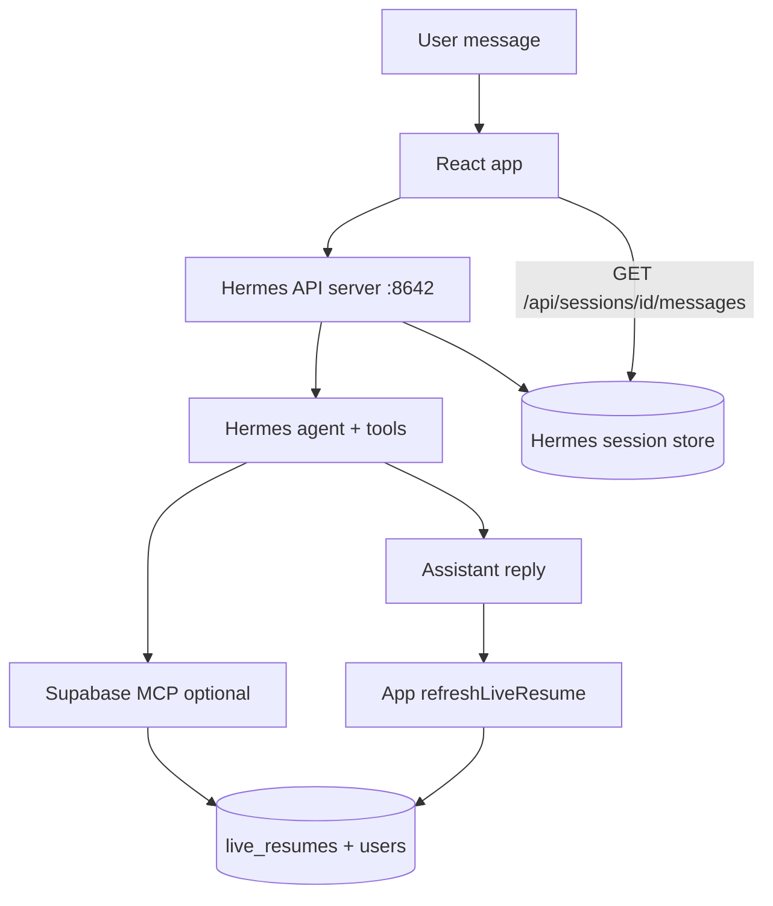

# Personal Dashboard — Hermes candidate chat

Candidate chat on the Personal Dashboard uses **Hermes Agent** (`POST /v1/chat/completions` + `/api/sessions`), not OpenClaw.

Business Dashboard uses OpenClaw for CV import and potential-candidate recruiter chat — see [`OPENCLAW_CV_README.md`](./OPENCLAW_CV_README.md) and [`OPENCLAW_BUSINESS_CANDIDATE_CHAT.md`](./OPENCLAW_BUSINESS_CANDIDATE_CHAT.md).

---

## Architecture



| Flow | Who writes | What the app does |
|------|------------|-------------------|
| **Chat** | Hermes agent (via MCP if configured) | Send message with session headers → show reply → **refresh** live resume from DB |
| **Chat history** | Hermes session store | Load on mount via `GET /api/sessions/{id}/messages` |
| **CV upload** | React app (`ingestResumeFile`) + Hermes extraction | Extract JSON via Hermes → write/merge in app |

---

## Session scoping

Each authenticated candidate gets a stable Hermes session:

| Concept | Value |
|---------|--------|
| Candidate key (both headers) | `skillscout-candidate-{userId}` |
| Session id (`X-Hermes-Session-Id`) | Same candidate key — short-term transcript continuity |
| Session key (`X-Hermes-Session-Key`) | Same candidate key — long-term Honcho memory scope |

Both headers are sent on **every** Hermes call (chat completions and `/api/sessions/*`). Honcho peer isolation comes from the session key header, not from text in the system prompt.

The Hermes session **title** is also set to the same candidate key. Honcho resolves session names from title before `X-Hermes-Session-Key`; a shared title like "SkillScout Candidate Chat" would collapse all candidates into one Honcho session.

The app sends **only the latest user message** (+ system prompt) to Hermes; prior turns are loaded from the Hermes session database via the session id header.

---

## Local development

1. Use the dedicated **skillscout** Hermes profile (do not inherit a personal profile’s fixed Honcho `peerName`):

```bash
hermes -p skillscout honcho enable   # once, if not already enabled
hermes -p skillscout gateway run
```

Profile Honcho host config (`~/.hermes/profiles/skillscout/honcho.json`) should use a SkillScout-specific host (e.g. `hermes.skillscout`) with `aiPeer: skillscout-advisor` and **no shared `peerName`** for candidates — Honcho then scopes memory from `X-Hermes-Session-Key`.

2. Ensure API server auth in `~/.hermes/profiles/skillscout/.env` (Hermes rejects caller-supplied session keys without it):

```env
API_SERVER_ENABLED=true
API_SERVER_KEY=your-secret-key
API_SERVER_HOST=127.0.0.1
API_SERVER_PORT=8642
API_SERVER_CORS_ORIGINS=http://localhost:3000,http://127.0.0.1:3000
```

3. Portal `.env`:

```env
REACT_APP_HERMES_BASE_URL=/hermes
REACT_APP_HERMES_API_KEY=your-secret-key
REACT_APP_HERMES_MODEL=hermes-agent
REACT_APP_HERMES_PROXY_TARGET=http://127.0.0.1:8642
```

The CRA dev proxy forwards `/hermes/*` → `http://127.0.0.1:8642/*` (see `craco.config.js`).

**Do not** use `http://localhost:8642/v1` directly in the browser during `npm start` unless CORS is configured — prefer `/hermes`.

---

## Environment variables

| Variable | Purpose |
|----------|---------|
| `REACT_APP_HERMES_BASE_URL` | Gateway root (`/hermes` in dev, full URL in prod) |
| `REACT_APP_HERMES_API_KEY` | Bearer token — must match Hermes `API_SERVER_KEY` |
| `REACT_APP_HERMES_MODEL` | Model id advertised by Hermes (default `hermes-agent`) |
| `REACT_APP_HERMES_PROXY_TARGET` | Dev proxy target (default `http://127.0.0.1:8642`) |
| `REACT_APP_HERMES_TIMEOUT_MS` | Request timeout (default `120000`) |
| `REACT_APP_MOCK_AI` | `true` — mock chat; no Hermes calls |

OpenClaw variables (`REACT_APP_OPENCLAW_*`) are for **Business Dashboard** Candidate Management CV import only.

---

## CV extraction (Personal Dashboard)

Full resume parsing from uploaded CVs uses `src/lib/hermes/cv-extraction.js`. Hermes returns structured JSON via chat/completions; the React app writes to Supabase. MCP is not required for CV upload — only for chat-driven resume edits.

---

## Smoke test

```bash
curl -sS http://127.0.0.1:8642/health

curl -sS http://127.0.0.1:8642/v1/models \
  -H "Authorization: Bearer YOUR_API_SERVER_KEY"

curl -sS http://localhost:3000/hermes/v1/models \
  -H "Authorization: Bearer YOUR_API_SERVER_KEY"
```

---

## Code map

| Path | Role |
|------|------|
| `src/lib/hermes/` | Hermes client, sessions, candidate chat |
| `src/lib/hermes/cv-extraction.js` | Personal Dashboard CV → JSON extraction |
| `src/lib/openclaw/` | OpenClaw client + Business Dashboard CV extraction |
| `src/lib/openclaw-cv-extraction.js` | Facade re-export for Business Dashboard imports |
| `src/modules/CandidateAssessment/hooks/useChat.js` | Hermes-backed chat hook |

See also [`HERMES_LIVE_RESUME.md`](./HERMES_LIVE_RESUME.md) for live resume + MCP behaviour.
