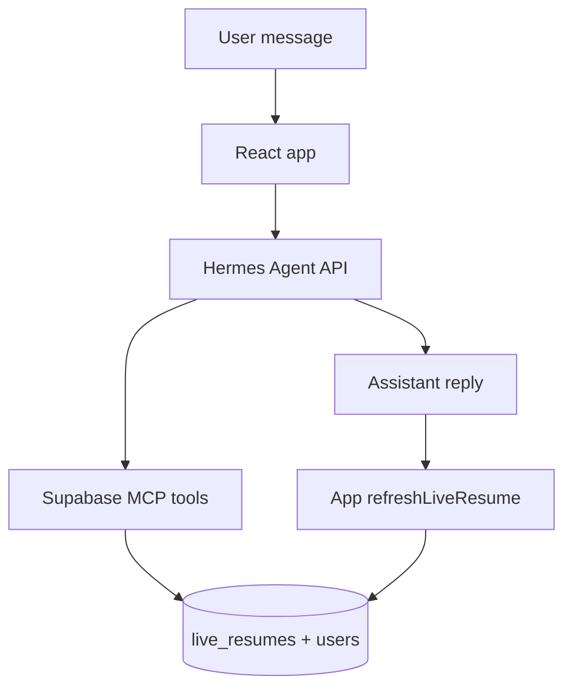

# Live Resume — Hermes chat + Supabase Integration

> **Chat provider:** Personal Dashboard uses **Hermes** only (`src/lib/hermes/`). See [`HERMES_CANDIDATE_CHAT.md`](./HERMES_CANDIDATE_CHAT.md). **OpenClaw** (`src/lib/openclaw/`) is for Business Dashboard Candidate Management only.

Candidate chat and CV upload persist resume data to Supabase (`live_resumes`, `resumes`, `user_data_sources`, `users`).

---

## Architecture



| Flow | Who writes | What the app does |
|------|------------|-------------------|
| **Chat updates** | Hermes agent via Supabase MCP | Send message → show reply → **refresh** live resume from DB |
| **CV upload** | React app + **Hermes** JSON extraction | Extract via Hermes → write/merge in app |

The React app does **not** extract or upsert live resume data after chat replies. Hermes + MCP is the sole writer for chat-driven changes.

---

## Hermes gateway — Supabase MCP

Configure Supabase MCP on your Hermes agent profile (same tools the agent uses for resume read/write). The React app passes the authenticated user's UUID in the system prompt for MCP scoping (never shown to the candidate).

Session headers sent with each chat request:

```
X-Hermes-Session-Id: skillscout-candidate-{userId}
X-Hermes-Session-Key: skillscout-candidate-{userId}
```

---

## Gateway agent instructions (copy-paste)

Add these rules to your Hermes agent / skill configuration (see `~/.hermes/skills/skillscout/skillscout-live-resume/SKILL.md` for the full skill):

### User-facing replies

- Confirm resume changes in **plain, conversational language** only.
- **Never** mention table names, column names, JSON keys, MCP, Supabase, or `` `field: value` `` syntax.
- **Never** narrate tool calls or describe what was written to storage.
- Good: *"Done — I've updated your Agilit-e role to 2018–present."*
- Bad: *"Updated end_date to Current and is_current to true in resume records."*

### MCP write behavior (surgical updates)

When the candidate asks to change part of their resume:

1. **Read** the current `live_resumes` row and `users` row for the session user id.
2. Apply **surgical changes only** — e.g. match an experience entry by `company` or `title`, update only the requested fields (`end_date`, `is_current`, etc.).
3. **Write back the full merged JSON** — do not replace `live_resumes.content` with a partial object that drops other jobs, skills, or education.
4. If the user says *"don't change anything else"*, change only the matched item/fields.
5. Do not replace entire sections unless the user explicitly asks for a full rewrite.

---

## Environment variables

See [`HERMES_CANDIDATE_CHAT.md`](./HERMES_CANDIDATE_CHAT.md) for chat and CV extraction env. Business Dashboard CV import uses [`OPENCLAW_CV_README.md`](./OPENCLAW_CV_README.md).

| Variable | Purpose |
|----------|---------|
| `REACT_APP_HERMES_BASE_URL` | Hermes API root (`/hermes` in dev) — chat + Personal Dashboard CV extraction |
| `REACT_APP_HERMES_API_KEY` | Bearer token (matches `API_SERVER_KEY`) |
| `REACT_APP_MOCK_AI` | `true` — mock chat and CV extraction; no live resume updates from chat |
| `REACT_APP_OPENCLAW_*` | Business Dashboard Candidate Management CV import only |

---

## Tables

| Table | Purpose |
|-------|---------|
| `users` | Contact fields: name, email, phone, location, title, summary |
| `user_data_sources` | Registry: `resume_upload`, `chat`, `manual` |
| `resumes` | Parsed CV rows with `content` JSONB |
| `live_resumes` | Canonical merged profile (one row per user) |

RLS: authenticated users can only access their own rows (`user_id = auth.uid()`).

---

## Mock mode behaviour

When `REACT_APP_MOCK_AI=true` or Hermes is not configured:

- CV upload still works via the React app (Hermes extraction or sample mock data).
- Chat returns canned responses — **no live resume updates** (MCP is not invoked).
- The app still calls `refreshLiveResume()` after chat; the panel will not change until Hermes MCP is configured or a CV is uploaded.

---

## Smoke test

1. Log in as a candidate and open `/dashboard`.
2. Upload a PDF/DOCX resume — confirm the live resume panel populates.
3. Chat: *"Update my Agilit-e experience to 2018–present, don't change anything else."*
4. Confirm Hermes MCP updates only that entry; other jobs/skills unchanged after refresh.
5. Confirm the chat reply uses plain language with no `end_date`, `is_current`, or table names.
