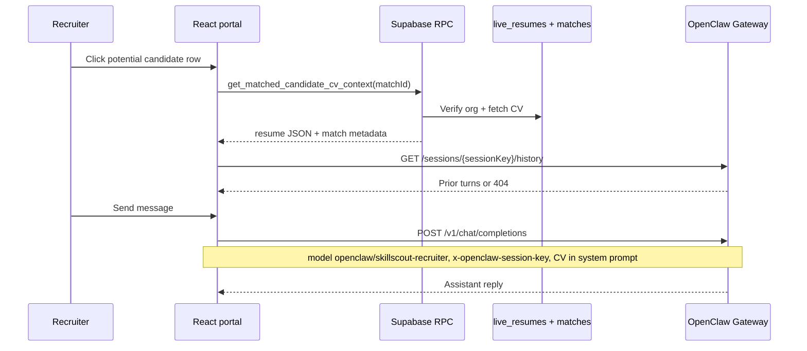

# Business Dashboard — Potential candidate chat (OpenClaw)

Recruiters chat about a **Potential Candidate** match from the Business Dashboard home. The app calls **OpenClaw Gateway** (`POST /v1/chat/completions` + session history APIs) with a **CV-only** policy: answers must come from that candidate's live resume text only.

Personal Dashboard candidate chat uses **Hermes** — see [`HERMES_CANDIDATE_CHAT.md`](./HERMES_CANDIDATE_CHAT.md).

CV import (Candidate Management) and the matcher worker use other OpenClaw surfaces — see [`OPENCLAW_CV_README.md`](./OPENCLAW_CV_README.md) and [`OPENCLAW_CANDIDATE_MATCHING.md`](./OPENCLAW_CANDIDATE_MATCHING.md).

---

## Architecture



| Flow | Who writes | What the app does |
|------|------------|-------------------|
| **CV context** | Supabase `live_resumes` | RPC `get_matched_candidate_cv_context` after org match validation |
| **Chat** | OpenClaw `skillscout-recruiter` agent | System prompt + latest user turn; gateway session stores transcript |
| **Chat history** | OpenClaw gateway session store | Load on modal open via `GET /sessions/{sessionKey}/history` |
| **Clear chat** | OpenClaw gateway | `DELETE /sessions/{sessionKey}` (or reset fallback) |

---

## CV-only policy

The app injects the full CV plain-text block into the **system prompt** on every turn. The `skillscout-recruiter` agent is configured on the gateway with matching base instructions (no tools / no web).

Rules enforced in [`business-candidate-chat.js`](./openclaw/business-candidate-chat.js):

- Answer **only** from the CV text in the system prompt
- No outside knowledge, speculation, or other candidates
- If not in the CV, say the CV does not contain that information
- Recruiter-facing professional tone; no internal IDs or schema jargon in replies

---

## Session scoping

| Concept | Value |
|---------|--------|
| Session key | `skillscout-business-{orgId}-{recruiterUserId}-match-{matchId}` |
| HTTP header | `x-openclaw-session-key` (same value) |
| OpenAI `user` field | Same session key (gateway derives stable session) |
| OpenClaw model | `openclaw/skillscout-recruiter` (`REACT_APP_OPENCLAW_BUSINESS_CHAT_MODEL`) |

OpenClaw is **stateless by default** if no stable `user` / session key is sent. SkillScout always sends the same key per recruiter + match row so transcripts persist on the gateway.

Contrast with Hermes: [`HERMES_CANDIDATE_CHAT.md`](./HERMES_CANDIDATE_CHAT.md) uses `X-Hermes-Session-Id` / Honcho via a separate API server.

---

## Dedicated OpenClaw agent: `skillscout-recruiter`

Do **not** reuse `openclaw/default` (CV import) or `skillscout-scout` (matcher scoring).

Register on the gateway host in `~/.openclaw/openclaw.json` (example — adjust to your OpenClaw version):

```json5
{
  agents: {
    skillscout-recruiter: {
      // Base instructions: CV-only recruiter Q&A, no tools, no web/MCP
      instructions: "You are SkillScout Recruiter Assistant. Answer only from the candidate CV in the system prompt. Refuse outside knowledge and other candidates."
    }
  }
}
```

Enable chat completions as in [`OPENCLAW_CV_README.md`](./OPENCLAW_CV_README.md).

---

## Local development

1. OpenClaw gateway on port 18789 with chat completions enabled.
2. Register `skillscout-recruiter` agent (above).
3. Portal `.env`:

```env
REACT_APP_OPENCLAW_BASE_URL=/openclaw/v1
REACT_APP_OPENCLAW_GATEWAY_TOKEN=your-openclaw-gateway-token
REACT_APP_OPENCLAW_BUSINESS_CHAT_MODEL=openclaw/skillscout-recruiter
```

4. Optional mock (no gateway): `REACT_APP_MOCK_AI=true`

Restart `npm start` after `.env` changes.

Session history is fetched at `/openclaw/sessions/...` (gateway root). The CRA proxy forwards `/openclaw/*` to the gateway — same as CV extraction.

---

## Environment variables

| Variable | Dev typical | Purpose |
|----------|-------------|---------|
| `REACT_APP_OPENCLAW_BASE_URL` | `/openclaw/v1` | Chat completions base |
| `REACT_APP_OPENCLAW_GATEWAY_TOKEN` | Gateway bearer token | Auth |
| `REACT_APP_OPENCLAW_BUSINESS_CHAT_MODEL` | `openclaw/skillscout-recruiter` | Recruiter chat agent only |
| `REACT_APP_OPENCLAW_MODEL` | `openclaw/default` | CV import only (unchanged) |
| `REACT_APP_OPENCLAW_PROXY_TARGET` | `http://127.0.0.1:18789` | Dev proxy target |
| `REACT_APP_MOCK_AI` | `true` | Skip gateway; in-memory mock sessions |

---

## Smoke tests

**List models** (should include `openclaw/skillscout-recruiter` after agent registration):

```bash
curl -sS http://localhost:3000/openclaw/v1/models \
  -H "Authorization: Bearer YOUR_TOKEN"
```

**Stable session chat** (reuse same `user` / session key across calls):

```bash
curl -sS http://127.0.0.1:18789/v1/chat/completions \
  -H "Authorization: Bearer YOUR_TOKEN" \
  -H "Content-Type: application/json" \
  -H "x-openclaw-session-key: skillscout-business-test-org-test-user-match-test-match" \
  -d '{
    "model": "openclaw/skillscout-recruiter",
    "user": "skillscout-business-test-org-test-user-match-test-match",
    "temperature": 0.3,
    "messages": [
      {"role":"system","content":"Candidate CV:\n---\nSkills: JavaScript, React\n---\nAnswer only from the CV."},
      {"role":"user","content":"What skills does this candidate have?"}
    ]
  }'
```

---

## Code map

| Path | Role |
|------|------|
| `src/lib/OPENCLAW_BUSINESS_CANDIDATE_CHAT.md` | This doc |
| `src/lib/openclaw/business-candidate-chat.js` | CV-only system prompt + send message |
| `src/lib/openclaw/sessions.js` | Session key, history fetch, reset |
| `src/lib/openclaw/client.js` | `callChatCompletions`, `openclawFetch`, `x-openclaw-session-key` |
| `src/lib/openclaw/config.js` | `getOpenClawBusinessChatModel()` |
| `src/lib/chat/adapters/businessOpenClawAdapter.js` | `ChatServiceAdapter` for `useChatSession` |
| `src/lib/resume/resumeSearchText.js` | CV plain text for prompts |
| `src/modules/BusinessDashboard/Home/components/PotentialCandidateChatModal.js` | Modal UI |
| `src/modules/BusinessDashboard/Home/hooks/useBusinessCandidateChat.js` | Hook wiring |
| `src/modules/BusinessDashboard/Home/controllers/candidateCvContext.js` | Supabase RPC client |
| `supabase/migrations/..._matched_candidate_cv_context.sql` | Org-gated CV RPC |

---

## Troubleshooting

| Symptom | Likely cause |
|---------|----------------|
| "CV is not available" | Candidate has no `live_resumes` row |
| "Match not found" | Wrong org or stale match id |
| Empty gateway history (404) | New session — expected until first message |
| Wrong agent behavior | Model not `openclaw/skillscout-recruiter` or agent not registered |
| CORS in browser | Use `/openclaw/v1` in dev, not raw `localhost:18789` |
| Mock mode always on | `REACT_APP_MOCK_AI=true` or missing `REACT_APP_OPENCLAW_BASE_URL` |
