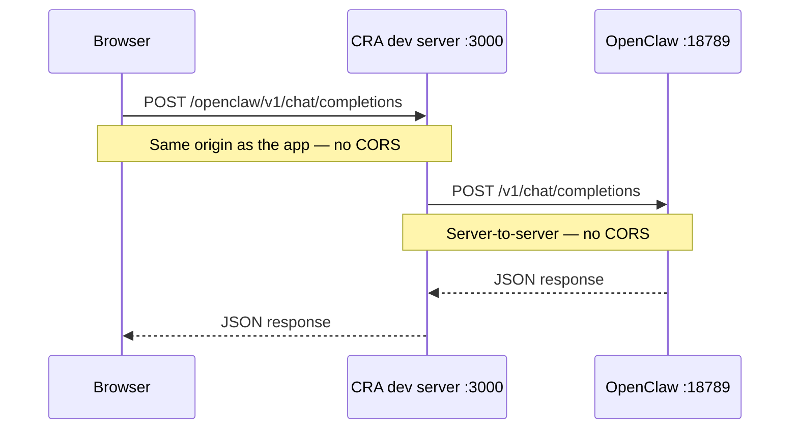

# Candidate Management — OpenClaw CV extraction

CV import calls **OpenClaw Gateway** (`POST /v1/chat/completions`), not OpenAI cloud or Supabase Edge Functions.

---

## How the dev proxy works (local development)

When you run `npm start`, the React **dev server** (usually `http://localhost:3000`) can forward certain requests to OpenClaw so the **browser never talks to port 18789 directly**. That avoids CORS.



| Step | What happens |
|------|----------------|
| 1 | Your app calls `fetch('/openclaw/v1/chat/completions', …)` |
| 2 | Browser sends that to **the same host** as the portal (`localhost:3000`) |
| 3 | `craco.config.js` **proxy** matches paths starting with `/openclaw` |
| 4 | Dev server strips `/openclaw` and forwards to `http://127.0.0.1:18789` |
| 5 | So OpenClaw receives `http://127.0.0.1:18789/v1/chat/completions` |

**Important:** The proxy exists only in **development** (`npm start`). A production build (`npm run build` + static hosting) does **not** include this proxy — use a shared OpenClaw URL or your own reverse proxy there.

### What you put in `.env` (local dev)

```env
REACT_APP_OPENCLAW_BASE_URL=/openclaw/v1
REACT_APP_OPENCLAW_GATEWAY_TOKEN=your-openclaw-gateway-token
REACT_APP_OPENCLAW_MODEL=openclaw/default
```

Optional — only if OpenClaw is not on the default port/host:

```env
REACT_APP_OPENCLAW_PROXY_TARGET=http://127.0.0.1:18789
```

### What **not** to use in local dev

```env
# Causes CORS in the browser — do not use with npm start
REACT_APP_OPENCLAW_BASE_URL=http://localhost:18789/v1
```

If you set a localhost URL anyway, the app will **rewrite** it to `/openclaw/v1` in development and log a note in the console.

### After changing `.env`

Restart `npm start` so env vars and the proxy config reload.

---

## OpenClaw setup (same machine)

1. Enable Chat Completions in `~/.openclaw/openclaw.json`:

```json5
{
  gateway: {
    http: {
      endpoints: {
        chatCompletions: { enabled: true }
      }
    }
  }
}
```

2. Start the gateway:

```bash
openclaw gateway --port 18789
```

3. Use the gateway token in `REACT_APP_OPENCLAW_GATEWAY_TOKEN`.

Docs: [OpenClaw OpenAI HTTP API](https://docs.openclaw.ai/gateway/openai-http-api)

---

## Environment variables

| Variable | Local dev (`npm start`) | Production / shared |
|----------|-------------------------|---------------------|
| `REACT_APP_OPENCLAW_BASE_URL` | `/openclaw/v1` | Full URL, e.g. `https://openclaw.internal/v1` |
| `REACT_APP_OPENCLAW_GATEWAY_TOKEN` | Gateway bearer token | Same |
| `REACT_APP_OPENCLAW_MODEL` | `openclaw/default` | Same |
| `REACT_APP_OPENCLAW_PROXY_TARGET` | `http://127.0.0.1:18789` (dev proxy target) | N/A |
| `REACT_APP_OPENCLAW_TIMEOUT_MS` | `120000` (optional) | Optional |
| `REACT_APP_MOCK_AI` | `true` to skip OpenClaw | Same |

---

## Smoke tests

**OpenClaw directly** (terminal — not through the browser):

```bash
curl -sS http://127.0.0.1:18789/v1/models -H "Authorization: Bearer YOUR_TOKEN"
```

**Through the dev proxy** (with `npm start` running):

```bash
curl -sS http://localhost:3000/openclaw/v1/models -H "Authorization: Bearer YOUR_TOKEN"
```

Both should return model data if OpenClaw and the token are correct.
